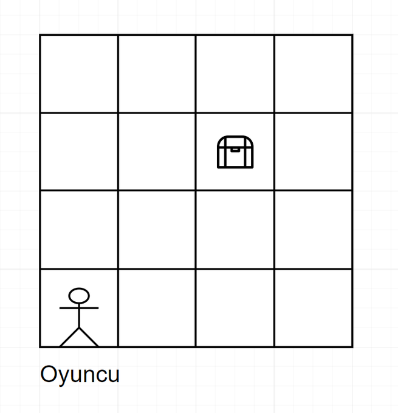

# Find the Treasure

This is a very basic game to learn basics of Rust (or any language, but I wrote this one in Rust)

Game logic is simple:

You have a player and a treasure, the player needs to find the treasure by going north, south, west and east.
Every turn, You will tell the player where it can go, and it's current location. If it finds the treasure or press Q
the game will end.